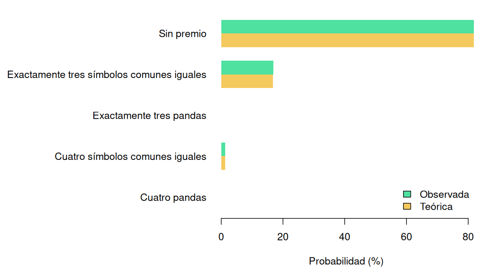
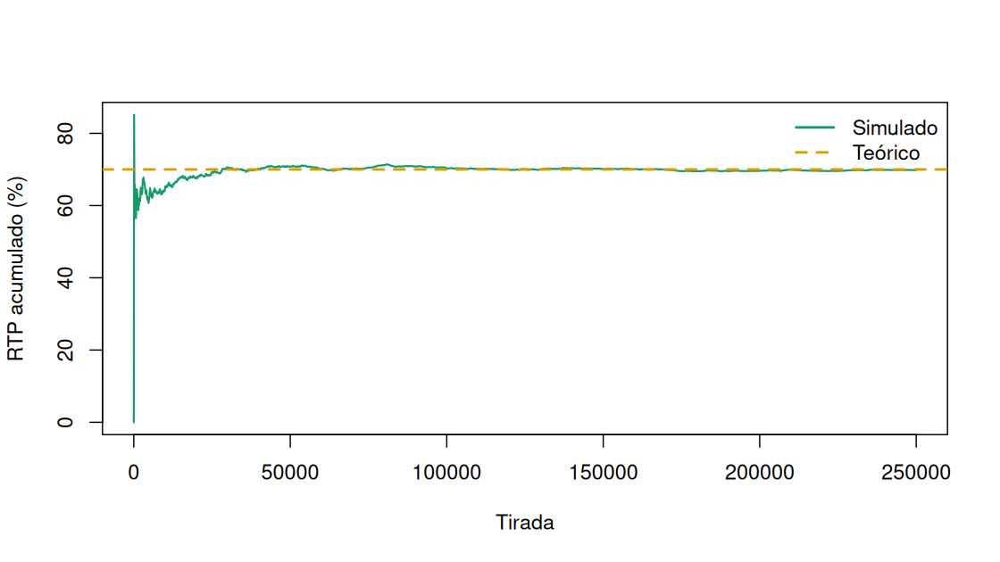

# Objetivo

Este documento reconstruye y corrige una práctica universitaria sobre una
máquina tragaperras de cuatro rodillos. El objetivo es diseñar una tabla de
premios con un retorno cercano al 70 %, demostrar el valor de forma exacta y
contrastarlo mediante simulación.

La máquina utiliza cuatro símbolos comunes con probabilidad 0,24 y un panda con
probabilidad 0,04. Cada tirada cuesta 1 EUR.

# Espacio muestral exacto

Con cinco símbolos y cuatro rodillos existen 625 resultados
ordenados. En vez de depender de fórmulas aisladas, el programa enumera todos
los casos y comprueba que sus probabilidades suman uno.


``` r
outcomes <- enumerate_outcomes(machine)
c(outcomes = nrow(outcomes), probability_sum = sum(outcomes$probability))
```

```
##        outcomes probability_sum
##             625               1
```


|Resultado                                 | Probabilidad| Premio_EUR| Contribucion_RTP|
|:-----------------------------------------|------------:|----------:|----------------:|
|Cuatro pandas                             |   0.00000256|        126|       0.00032256|
|Cuatro símbolos comunes iguales           |   0.01327104|         26|       0.34504704|
|Exactamente tres pandas                   |   0.00024576|         75|       0.01843200|
|Exactamente tres símbolos comunes iguales |   0.16809984|          2|       0.33619968|
|Sin premio                                |   0.81838080|          0|       0.00000000|

La probabilidad de obtener cualquier premio es
18.161920 %. El resultado más frecuente es no
obtener premio, con una probabilidad de
81.838080 %.

# Tabla de premios

La tabla incluida asigna 126 EUR a cuatro pandas, 75 EUR a tres pandas, 26 EUR
a cuatro símbolos comunes y 2 EUR a tres símbolos comunes. Su retorno exacto es:


``` r
c(
  expected_payout = theory$expected_payout,
  rtp = theory$rtp,
  house_edge = theory$house_edge,
  standard_deviation = theory$standard_deviation
)
```

```
##    expected_payout                rtp         house_edge standard_deviation
##          0.7000013          0.7000013          0.2999987          3.2521782
```

El buscador permite encontrar automáticamente alternativas enteras que respetan
la jerarquía de premios:


``` r
find_integer_paytable(machine, target_rtp = 0.70, max_results = 6)
```

```
##   four_pandas three_pandas four_common three_common       rtp distance
## 1         126           39          14            3 0.7000013 1.28e-06
## 2         222           38          14            3 0.7000013 1.28e-06
## 3         125           75          26            2 0.6999987 1.28e-06
## 4         126           57          39            1 0.7000013 1.28e-06
## 5         126           75          26            2 0.7000013 1.28e-06
## 6         126           93          13            3 0.7000013 1.28e-06
```

# Validación Monte Carlo

Se simulan 250.000 tiradas con una semilla fija. Esta simulación no sustituye el
cálculo exacto: actúa como comprobación independiente y muestra la variabilidad
de una muestra finita.


``` r
simulation <- simulate_spins(machine, n = 250000, seed = 2026)
simulation_result <- simulation_summary(simulation, machine)
c(
  observed_rtp = simulation_result$observed_rtp,
  theoretical_rtp = simulation_result$theoretical_rtp,
  ci_lower = simulation_result$rtp_confidence_interval[1],
  ci_upper = simulation_result$rtp_confidence_interval[2],
  observed_hit_rate = simulation_result$observed_hit_rate
)
```

```
##      observed_rtp   theoretical_rtp          ci_lower          ci_upper
##         0.6983240         0.7000013         0.6856259         0.7110221
## observed_hit_rate
##         0.1821880
```



## Convergencia

La línea verde representa el RTP acumulado de la simulación. La referencia
amarilla es el valor teórico.



# Conclusión

La enumeración exacta confirma un RTP de
70.000128 %, a una distancia de
0.000128 puntos porcentuales del objetivo.
La simulación reproduce el comportamiento dentro de la incertidumbre esperada.

La reimplementación también corrige las dos debilidades principales del trabajo
original: categorías calculadas con probabilidades equivocadas y una tabla de
premios cuya rentabilidad nunca se verificaba. Todo resultado de este informe se
puede regenerar desde el repositorio.
